<!-- ═══════════════════════ HERO ═══════════════════════ -->
<div align="center">
</div>

<br/>

<div align="center">
<a href="https://karaa.my"></a>
<a href="https://www.linkedin.com/in/karaa-kamaran-246863284/"></a>
<a href="https://dev.to/karaa1122"></a>

</div>


<!-- ═══════════════════════ ABOUT ═══════════════════════ -->
## `⟨/⟩` About Me

> **Good software works at 3am without anyone watching.**

```python
class BackendEngineer:
    name     = "Karaa Kamaran"
    location = "Erbil, Kurdistan"
    role     = "Backend Engineer @ RIGT Company"      # June 2023 — present
    degree   = "BSc Computer Science, Salahaddin University (2022)"
    website  = "https://karaa.my"

    domains = ["Fintech", "Payments", "E-Commerce", "Industrial / IoT", "Platforms"]

    specialties = [
        "Card middleware — authorization, clearing, settlement",
        "Immutable double-entry ledgers & money movement",
        "Event-driven systems (Kafka, RabbitMQ, Celery)",
        "Microservices, CQRS & Domain-Driven Design",
        "High-performance REST APIs that hold under load",
    ]

    philosophy = "The system works, or it doesn't. There's no in between."
```


<!-- ═══════════════════════ TERMINAL ═══════════════════════ -->
## `$` Under the Hood

<div align="center">
</div>


<!-- ═══════════════════════ PROJECTS ═══════════════════════ -->
## `🚀` Things I've Shipped

<table>
<tr>
<td width="50%"><a href="https://rigt.com/products"></a></td>
<td width="50%"><a href="https://nasspay.com"></a></td>
</tr>
<tr>
<td width="50%"><a href="https://github.com/karaa1122/wallet-ledger"></a></td>
<td width="50%"><a href="https://nass.iq/products/acquiring"></a></td>
</tr>
<tr>
<td width="50%"><a href="https://devfolioapp.cloud"></a></td>
<td width="50%"><a href="https://eventyapp.org"></a></td>
</tr>
<tr>
<td width="50%"><a href="https://arbela.store"></a></td>
<td width="50%"></td>
</tr>
<tr>
<td width="50%"><a href="https://shorshmarket.com"></a></td>
<td width="50%"><a href="https://memancompany.com"></a></td>
</tr>
</table>

<div align="center">

**`3+` years building production backends.** Fintech, industrial systems, e-commerce, platforms.
Different domains, same standard — *the system works, or it doesn't.*

</div>


<!-- ═══════════════════════ EXPERIENCE ═══════════════════════ -->
## `🧭` Experience

<div align="center">
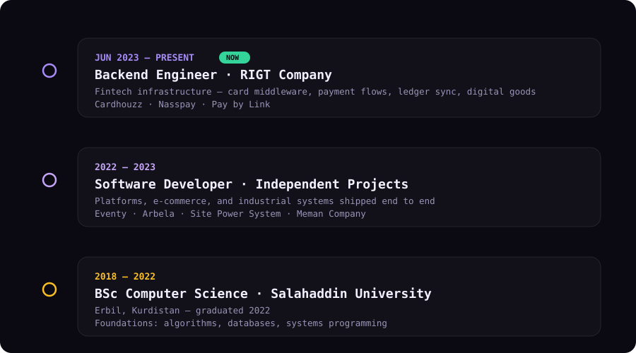
</div>


<!-- ═══════════════════════ TECH STACK ═══════════════════════ -->
## `⚡` Tech Stack

<div align="center">

**Languages**


**Backend**


**Data & Messaging**


**Infra & DevOps**


</div>


<!-- ═══════════════════════ SKILLS MATRIX ═══════════════════════ -->
## `📈` Skills Matrix

<div align="center">
</div>


<!-- ═══════════════════════ GITHUB STATS ═══════════════════════ -->
## `📊` GitHub Statistics

<div align="center">


<picture>
  <source media="(prefers-color-scheme: dark)" srcset="https://raw.githubusercontent.com/karaa1122/karaa1122/output/github-snake-dark.svg"/>
  <source media="(prefers-color-scheme: light)" srcset="https://raw.githubusercontent.com/karaa1122/karaa1122/output/github-snake.svg"/>
  
</picture>

</div>


<!-- ═══════════════════════ CONTACT ═══════════════════════ -->
## `📫` Don't Be a Stranger

<div align="center">

<a href="mailto:karaa.kamaran@gmail.com"></a>

<br/><br/>

| | |
|---:|:---|
| `EMAIL` | [karaa.kamaran@gmail.com](mailto:karaa.kamaran@gmail.com) |
| `PORTFOLIO` | [karaa.my](https://karaa.my) |
| `LINKEDIN` | [karaa-kamaran](https://www.linkedin.com/in/karaa-kamaran-246863284/) |
| `WRITING` | [dev.to/karaa1122](https://dev.to/karaa1122) |
| `LOCATION` | Erbil, Kurdistan, Iraq |

<br/>

> *Write it clean, make it fast, make sure it holds.*


</div>
